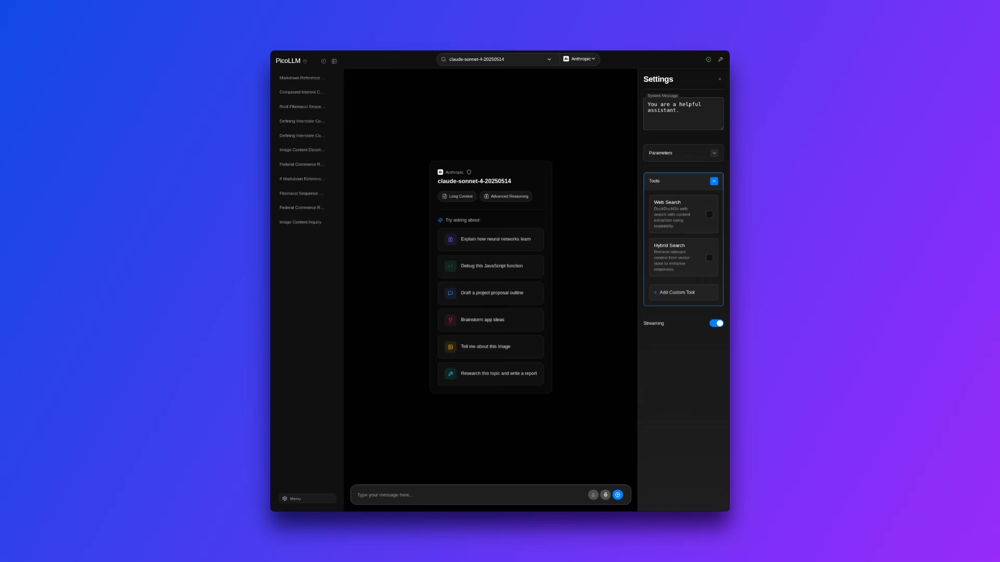

# PicoLLM

  

Platform agnostic LLM inference playground that supports OpenAI and Anthropic format models as well as other OpenAI compatible servers.

### Features

+ Python client to unify providers
+ SvelteKit UI to manage chats
+ Comprehensive settings
+ Support for 'reasoning' models on all providers
+ Multimodal messages
+ Pydantic Model Structured output
+ Tool calling
+ Custom tool support in-app
+ Huggingface datasets & transformers integration
+ Qdrant database with collection builder
+ In-conversation memory
+ Postgres chat history
+ Custom themes for code blocks
+ Export one, several, or all conversations, including tool calling data, for finetuning models (chatml format)

[](https://drive.google.com/file/d/12O0ZghMofF-Z1pHEx14DnDV71KsGdJjF/view?usp=drive_link)

Demo image links to google drive player with demo video

### Use Cases

+ Python [client](/docs/client.md) to build your own hybrid search applications
+ Python [API](/docs/api.md) if you want to build your own frontend
+ Utilize the huggingface [datasets](https://github.com/huggingface/datasets) library for RAG or to explore the dataset
+ Chat playground supporting strucutred output and dynamic function calling

## Prerequisites

- [Docker](https://docs.docker.com/engine/install/)
- [Nvidia Container Toolkit](https://docs.nvidia.com/datacenter/cloud-native/container-toolkit/latest/install-guide.html)
- [Ollama](https://ollama.com/), [vllm](https://github.com/vllm-project/vllm), or both if you want.
 
    Docker requires ~6.5Gb of RAM allocated to the whole build when converting datasets to points as this uses 3 embedding models. Once built the startup/load time from cache is near instant.

## Install

### Docker

```bash
git clone https://github.com/picoLLM/picoLLM.git
cd picoLLM
cp .env.copy .env
# fill out the .env with your configuration
```

```bash
docker compose up --build
```

### Local

Make sure you have [postgres](https://www.postgresql.org/download/) and [qdrant](https://github.com/qdrant/qdrant) installed, running, and configured in the .env.

+ Backend &rarr;

```bash
git clone https://
cd picoLLM
cp .env.copy .env
pip install .
# uv pip install .
```

+ Frontend &rarr;

```bash
cd frontend
cp .env.copy .env 
npm install
cd ../
```

**Run**:

```bash
chmod +x run_local.sh
./run_local.sh
```

or 

```bash
cd backend && python main.py
cd ../frontend && npm run dev
```

## Models

### Ollama

picoLLM will use your local ollama library. If deploying in a cloud environment and need to deploy with an inference engine use the appropriate docker compose file in `/configs`

### vLLM

vLLM requires you to launch the model directly. You can use vLLM either locally, on docker, or a cloud deployment. If cloud deployment make sure to change the default VLLM_HOST in the .env and use the appropriate docker compose file in `/configs`

```bash
vllm serve RedHatAI/Meta-Llama-3.1-8B-Instruct-FP8  \
--max-model-len 60000 \
--enable-auto-tool-choice \
--tool-call-parser llama3_json
```

### OpenAI

To use OpenAI models, set your API key in the .env.

### Anthropic

To use Anthropic models, set your API key in the .env.

## Usage

The application will be available at:

`http://0.0.0.0:5173`


## Contributing

If you would like to contribute just make a pull request. They are all welcome.

[Development config](/configs/docker-compose.dev.yml)

+ This will require you to add the frontend path to your file sharing in docker for hot reload.

**To Do**: 
- [ ] `top_p` and `top_k` may cause errors on first load due to the settings state. They are set to be ommitted from the reqeust when set out of bounds and currently only are ommitting when they are explicitly set. 
- [ ] Embeddings need a dedicated solution to offload torch from the main container without it resulting in redundant dependencies on both the main api and embeddings container. Will require a complete rework of the qdrant routes and I want to experiment with several things to find a more permanent solution
- [ ] Oauth solution 
- [ ] Kubernetes configuration
- [ ] Organization of the frontend. I will be migrating more of the files to the features folder, where each feature will mirror the `/$lib` file structure
- [ ] Google drive integration (backend is complete, but want to deal with oauth first as to avoid conflict with other oauth providers)
- [ ] MCP server connection through tools for both Anthropic and OpenAI